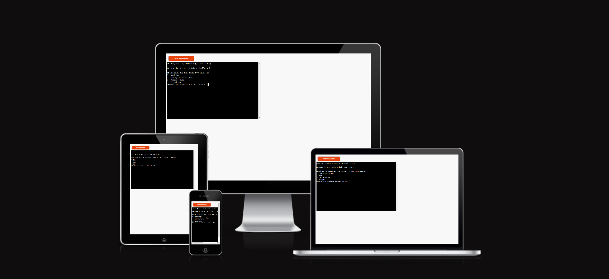

# Movie Trivia CLI Application

## Project Overview

Welcome to the Movie Trivia CLI Application, designed for movie enthusiasts and trivia lovers. This Python command-line application tests your knowledge of movies through a series of interactive questions, covering everything from classic films to modern blockbusters. It's a perfect challenge for film buffs or anyone looking to enjoy some fun trivia in their spare time!

Experience the quiz live here: [Movie Trivia Website](https://movie-trivia-python-version-6f66950c280f.herokuapp.com/).

## Technologies Used

- **Python**: For the core application logic and user interaction in the command-line.
- **Git**: For version control.
- **GitHub**: For repository hosting and sharing the application code.

## Key Project Goals

- Deliver an engaging command-line user experience with immediate feedback on answers.
- Provide a simple yet functional interface that allows easy navigation through quiz questions.
- Implement a scoring system to track user progress throughout the session.

## Features

- **Interactive Quiz Start**: Users can initiate the quiz with a simple command.
- **Score Tracking**: Real-time score updates as users answer each question.
- **End-of-Quiz Feedback**: Provides users with their total score and an option to restart the quiz.

## Python Package Used

- No external Python packages are used for the basic functionality, ensuring ease of use and compatibility.

## Testing

- **Manual Testing**: Conducted to ensure all functionalities work as expected under various scenarios.
- **Error Handling**: Extensively tested to handle user input errors gracefully without crashing the application.

## Deployment

- This application is designed to be run locally on any machine with Python installed.
- This project uses [Heroku](https://movie-trivia-python-version-6f66950c280f.herokuapp.com/), a platform as a service (PaaS) that  enables developers to build, run, operate  and   applications entirely in the cloud.

## Bugs

- No major bugs have been reported. Ongoing user feedback is encouraged to identify and fix any minor issues that might occur during extensive usage.

## Credits

- **Stack Overflow**: For solutions to common programming challenges encountered during development.
- **Python Documentation**: For guidelines on Python syntax and functionalities.

## Future Enhancements

- **GUI Version**: Develop a graphical user interface using libraries like Tkinter or PyQt to make the game more interactive.
- **Additional Questions**: Increase the question bank to ensure the quiz remains challenging and engaging for repeated plays.
- **Difficulty Levels**: Introduce difficulty settings to cater to both beginners and movie trivia experts.

### Notes on Running the Application

To run the application:
1. Ensure Python 3.x is installed on your machine.
2. Download the source code from the GitHub repository.
3. Navigate to the downloaded directory in your command line interface.
4. Run the command `python movie_trivia.py` to start the quiz.
"""
